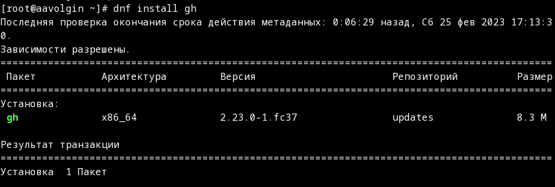
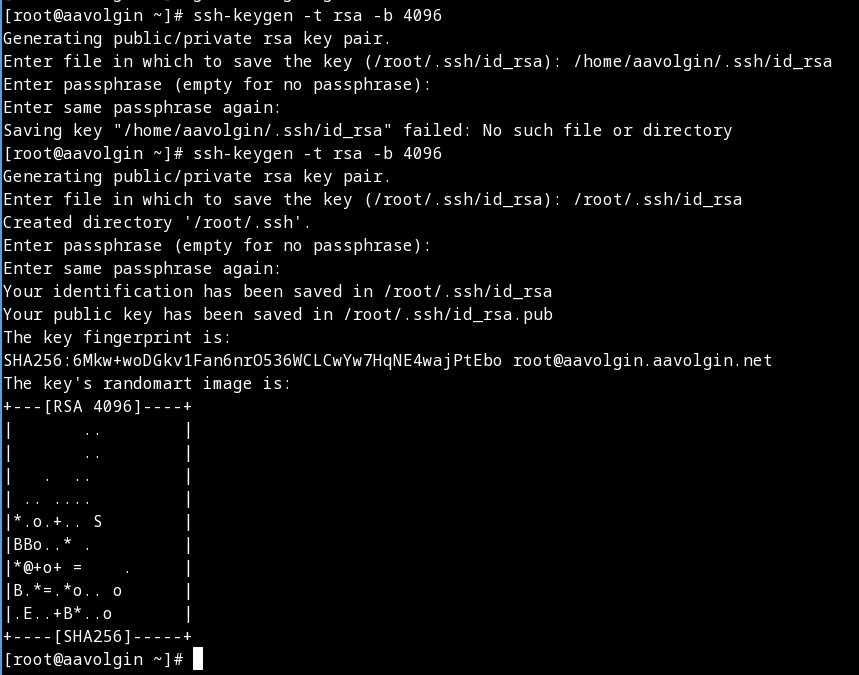
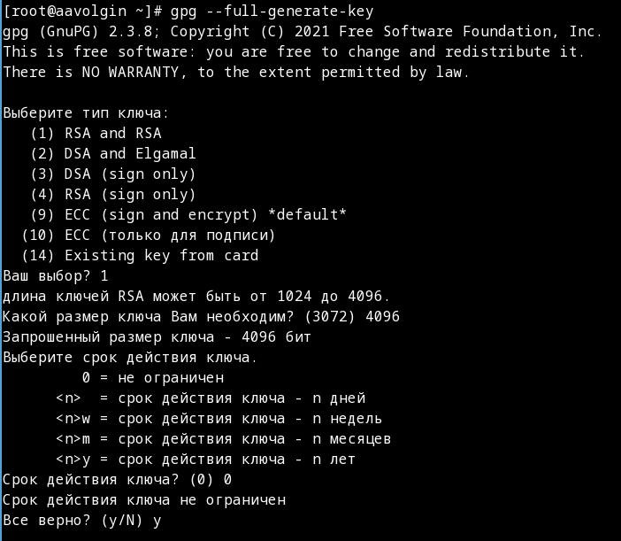
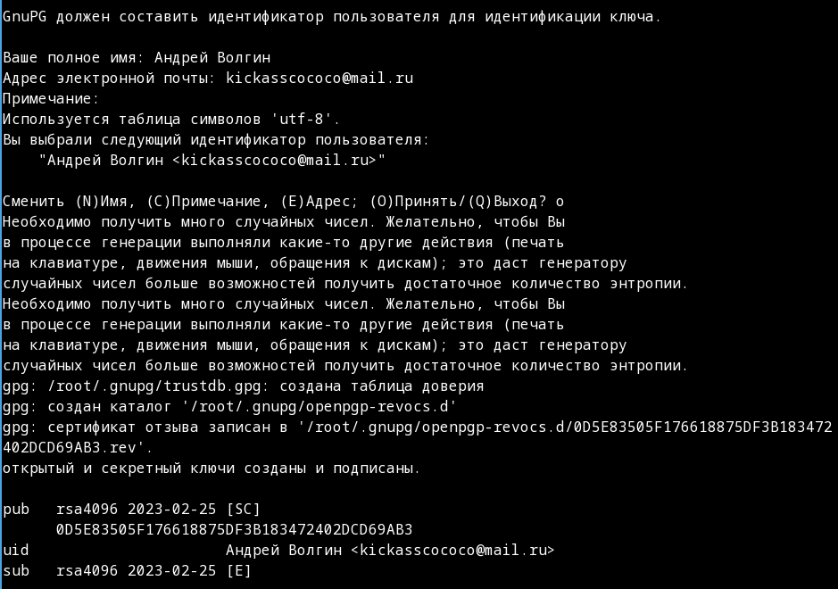
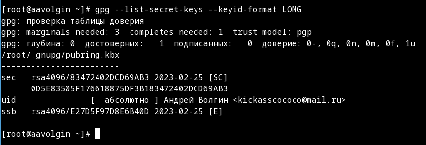
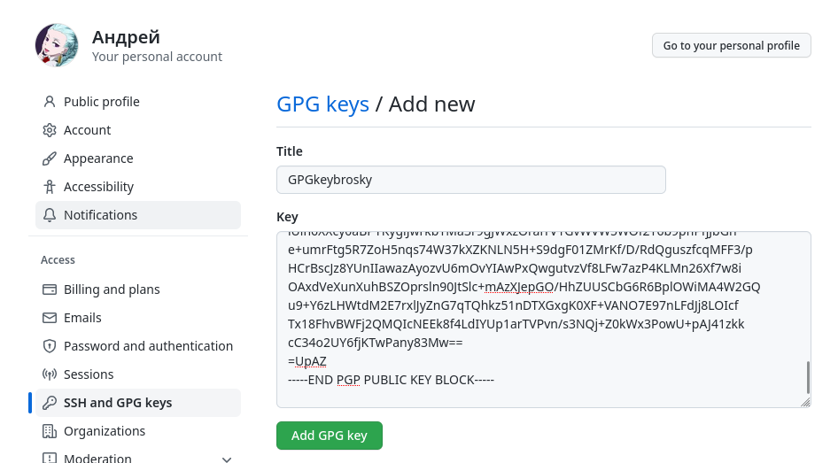
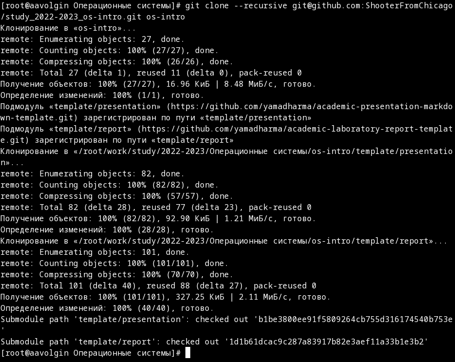

---
## Front matter
title: "Отчёт по лабораторной работе 2"
subtitle: "дисциплина: Операционные системы"
author: "Волгин Андрей	НПИбд-01-22"

## Generic otions
lang: ru-RU
toc-title: "Содержание"

## Bibliography
bibliography: bib/cite.bib
csl: pandoc/csl/gost-r-7-0-5-2008-numeric.csl

## Pdf output format
toc: true # Table of contents
toc-depth: 2
lof: true # List of figures
lot: true # List of tables
fontsize: 12pt
linestretch: 1.5
papersize: a4
documentclass: scrreprt
## I18n polyglossia
polyglossia-lang:
  name: russian
  options:
	- spelling=modern
	- babelshorthands=true
polyglossia-otherlangs:
  name: english
## I18n babel
babel-lang: russian
babel-otherlangs: english
## Fonts
mainfont: PT Serif
romanfont: PT Serif
sansfont: PT Sans
monofont: PT Mono
mainfontoptions: Ligatures=TeX
romanfontoptions: Ligatures=TeX
sansfontoptions: Ligatures=TeX,Scale=MatchLowercase
monofontoptions: Scale=MatchLowercase,Scale=0.9
## Biblatex
biblatex: true
biblio-style: "gost-numeric"
biblatexoptions:
  - parentracker=true
  - backend=biber
  - hyperref=auto
  - language=auto
  - autolang=other*
  - citestyle=gost-numeric
## Pandoc-crossref LaTeX customization
figureTitle: "Рис."
tableTitle: "Таблица"
listingTitle: "Листинг"
lofTitle: "Список иллюстраций"
lotTitle: "Список таблиц"
lolTitle: "Листинги"
## Misc options
indent: true
header-includes:
  - \usepackage{indentfirst}
  - \usepackage{float} # keep figures where there are in the text
  - \floatplacement{figure}{H} # keep figures where there are in the text
---

# Цель работы:

Целью данной работы является изучение идеологии и применения средств контроля версий и освоение умений по работе с git.

# Порядок выполнения лабораторной работы:

Заходим под правами суперпользователя, затем устанавливаем git и gh (рис. 1-2)

Затем зададим имя и email владельца репозитория,
настроим utf-8 в выводе сообщений git,
зададим имя начальной ветки (будем называть её master)
и установим параметры autocrlf и  safecrlf (рис. 3)

Создадим ключ ssh и ключ pgp (рис. 4)

При создании ключа gpg нужно будет составить идентификатор пользователя (рис. 6)

Выводим список ключей и копируем отпечаток приватного ключа (рис. 7)

И затем скопируем gpg ключ в свой аккаунт на гитхабе (рис. 8)

Настроим автоматическую подпись коммитов (рис. 9)

Проведем авторизацию (рис. 10)

Затем создадим репозиторий курса на основе заданного шаблона (рис. 11)

Затем удалим лишние файлы: rm package.json
Создадим необходимые каталоги: 
echo os-intro > COURSE
make
И отправим файлы на сервер (рис 12-13):
git add .
git commit -am 'feat(main): make course structure'
git push

# Ответы на контрольные вопросы: 

1. Что такое системы контроля версий (VCS) и для решения каких задач они предназначаются? 
Это программное обеспечение для облегчения работы с изменяющейся информацией. VCS позволяет хранить несколько версий одного и того же документа, при необходимости возвращаться к более ранним версиям, определять, кто и когда сделал то или иное изменение, и многое другое.
2. Объясните следующие понятия VCS и их отношения: хранилище, commit, история, рабочая копия. 
Хранилище (repository), или репозитарий, — место хранения всех версий и служебной информации. 
Commit («[трудовой] вклад», не переводится) — синоним версии; процесс создания новой версии.
История – место, где сохраняются все коммиты, по которым можно посмотреть данные о коммитах.
Рабочая копия – текущее состояние файлов проекта, основанное на версии, загруженной из хранилища.
3. Что представляют собой и чем отличаются централизованные и децентрализованные VCS? Приведите примеры VCS каждого вида.
Централизованные VCS: одно основное хранилище всего проекта и каждый пользователь копирует себе необходимые ему файлы из этого репозитория, изменяет и, затем, добавляет свои изменения обратно. 
Децентрализованные VCS:
у каждого пользователя свой вариант (возможно не один) репозитория.
4. Опишите действия с VCS при единоличной работе с хранилищем. 
5. Опишите порядок работы с общим хранилищем VCS. 
6. Каковы основные задачи, решаемые инструментальным средством git? 
Git — это система управления версиями. У Git две основных задачи: первая — хранить информацию о всех изменениях в вашем коде, начиная с самой первой строчки, а вторая — обеспечение удобства командной работы над кодом.
7. Назовите и дайте краткую характеристику командам git. 
git –version (Проверка версии Git)
git init (Инициализировать ваш текущий рабочий каталог как Git-репозиторий)
git clone https://www.github.com/username/repo-name (Скопировать существующий удаленный Git-репозиторий)
git remote (Просмотреть список текущих удалённых репозиториев Git)
git remote -v (Для более подробного вывода)
git add my_script.py (Можете указать в команде конкретный файл).
git add . (Позволяет охватить все файлы в текущем каталоге, включая файлы, чье имя начинается с точки)
git commit -am "Commit message" (Вы можете сжать все индексированные файлы и отправить коммит).
git branch (Просмотреть список текущих веток можно с помощью команды branch)
git –help (Чтобы узнать больше обо всех доступных параметрах и командах)
git push origin master (Передать локальные коммиты в ветку удаленного репозитория).
8. Приведите примеры использования при работе с локальным и удалённым репозиториями. 
9. Что такое и зачем могут быть нужны ветви (branches)? 
Ветки нужны, чтобы несколько программистов могли вести работу над одним и тем же проектом или даже файлом одновременно, при этом не мешая друг другу. Кроме того, ветки используются для тестирования экспериментальных функций: чтобы не повредить основному проекту, создается новая ветка специально для экспериментов.
10. Как и зачем можно игнорировать некоторые файлы при commit?
Игнорируемые файлы — это, как правило, артефакты сборки и файлы, генерируемые машиной из исходных файлов в вашем репозитории, либо файлы, которые по какой-либо иной причине не должны попадать в коммиты.

# Вывод:

Во время выполнения лабораторной работы были изучены идеология и применение средств контроля версий,
а также освоены умения по работе с git.
